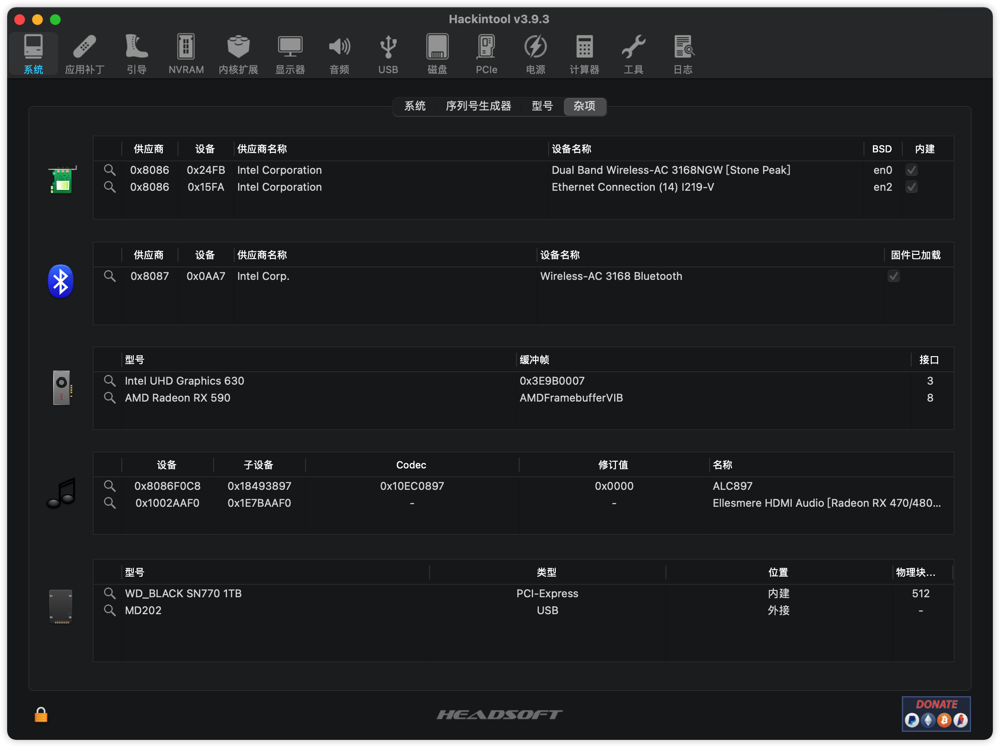
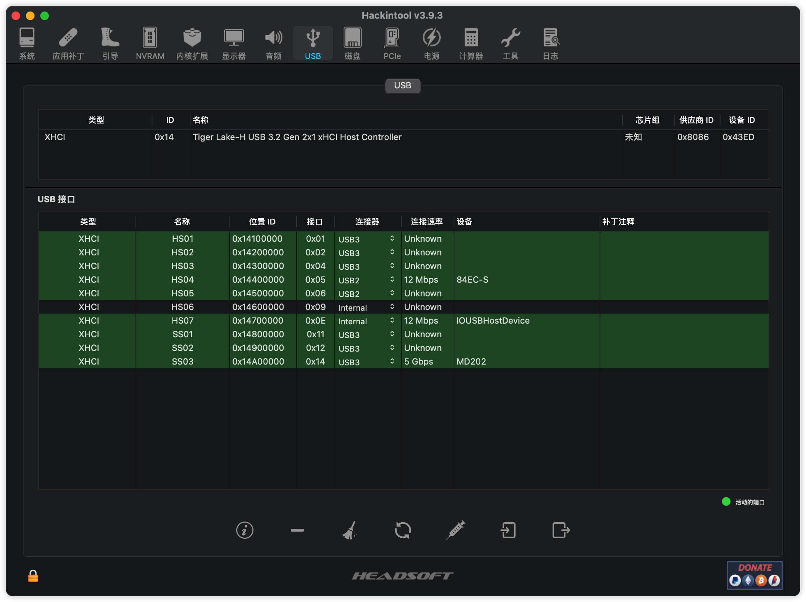
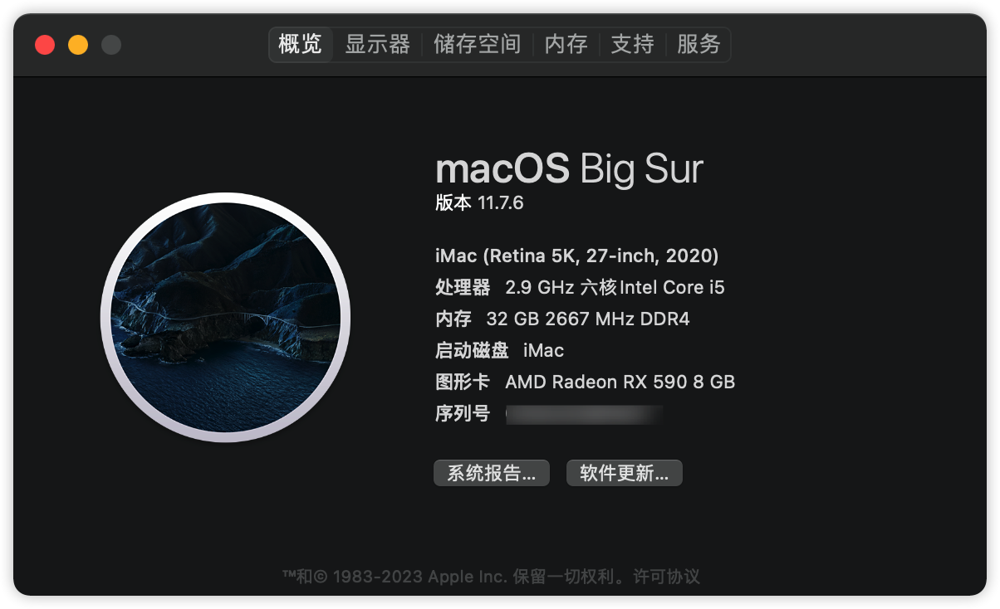

# AsrockH510M-ITX-ac-Hackintosh-OC
华擎H510m ITX/ac 黑苹果open core配置

## 1. 电脑配置

| 规格     | 详细信息             |
| -------- | -------------------- |
| 操作系统 | macOS Big Sur        |
| 主板     | 华擎H510M ITX/ac     |
| 处理器   | 英特尔 core i5-10400 |
| 内存     | 金士顿16G 2667 x2    |
| 硬盘     | WD SN770 1TB         |
| 显卡     | AMD Radeon RX590     |
| 声卡     | Realtek ALC897       |
| 无线网卡 | 主板自带 Intel 3168  |

## 2. BIOS设置

1. USB --> EHCI/XHCI Hand-off 启用
2. 如果想使用集成显卡，则 IGPU 把auto改为enable，共享内存可以设置为64 128或者最大值

## 3. 工作情况

1. 安装选择机型为 `iMac20,1` ，目前所有硬件均已工作，USB已经定制，睡眠正常（防止一些奇奇怪怪的问题睡眠失败，使用电源键唤醒。同时提供一个USB唤醒的EFI，可能某些场景在睡眠失效，经过我一天一晚的测试目前正常）。
2. 声卡使用alcid=66，目前我只使用主板自带3.5音频口，其他输出未测试，没有配置前置接口
3. 下载EFI后自行生成SMBIOS信息，然后安装即可。
4. intel网卡 Wi-Fi有时候断联，可能是驱动问题，需要等大佬更新。
5. 使用RX590的DP接口输出，HDMI暂时没有输出，不弄了。

## 4. 参考

本项目参考了许多H510M主板的配置，其中包括

1. https://github.com/nnhan0719/H510M-ITX-AC
2. https://github.com/hongthaiovi/ASROCK-H510M-ITX-AC-i3-10100-16GB-RX560-4G

还有远景论坛上各位大佬的解决方案

